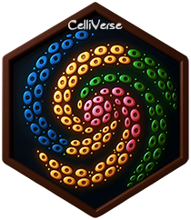

<!-- README.md is generated from README.Rmd. Please edit that file -->

# CelliVerse <a href='https://youtu.be/DaWosjBNvmw' target="_blank" rel="noopener noreferrer"></a>

<!-- badges: start -->

[](https://github.com/asalavaty/celliverse/actions/workflows/R-CMD-check.yaml)
[](https://cran.r-project.org/package=celliverse)
[](https://cran.r-project.org/package=celliverse)
[](https://cran.r-project.org/package=celliverse)

<!-- badges: end -->

## Overview

`CelliVerse` is a robust and versatile toolkit for single-cell RNA
sequencing (scRNA-seq) data analysis. It provides core functionalities
for clustering cells, identifying markers for pre-defined clusters,
performing sub-clustering of major cell populations, and discovering
markers within custom-selected subsets of cells. CelliVerse also
includes methods for analyzing cluster similarity and generating
intuitive visualizations. Designed to be independent of library size and
other sample- or cell-level confounding effects, CelliVerse ensures
reliable and interpretable results across a wide range of datasets.

## Author

The `CelliVerse` package was written by [Adrian
Salavaty](https://asalavaty.com/)

## Advisors

- Ramyar Molania

## How to Install

You can install the official [CRAN
release](https://cran.r-project.org/package=celliverse) of the
`CelliVerse` with the following code:

``` r
install.packages("celliverse")
```

Or the development version from GitHub:

``` r
## install.packages("remotes")
remotes::install_github("asalavaty/celliverse", build_vignettes = TRUE)
```

## Vignettes

A comprehensive introduction to `CelliVerse` and all of its functions is
available in the
[vignette](https://cran.r-project.org/package=celliverse/vignettes/Vignettes.html).

You may browse Vignettes from within R using the following code.

``` r
browseVignettes("celliverse")
```

## How to cite `CelliVerse`

To cite `CelliVerse`, please cite its associated paper:

- 

You can also refer to the package’s citation information using the
`citation()` function.

``` r
citation("celliverse")
```

## How to contribute

Please don’t hesitate to report any bugs/issues and request for
enhancement or any other contributions. To submit a bug report or
enhancement request, please use the [`CelliVerse` GitHub issues
tracker](https://github.com/asalavaty/celliverse/issues).
