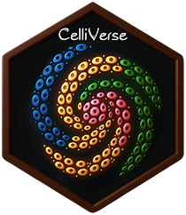

# CelliVerse [](https://asalavaty.com/widgets/celliVerse)

### Clustering, marker discovery, cell-type annotation, and natural-language single-cell analysis in R

A robust and versatile toolkit for interpretable single-cell
RNA-sequencing analysis.

## Overview

`CelliVerse` is an R toolkit for **single-cell RNA-sequencing
(scRNA-seq)** analysis, with integrated functionality for clustering,
sub-clustering, marker discovery, cell-type annotation, cluster
comparison, and visualization.

At its core, **ClustoCell** provides a data-driven framework for
identifying major cellular populations and resolving biologically
meaningful sub-populations while simultaneously generating ranked
positive and negative marker profiles. CelliVerse also supports marker
discovery for pre-defined clusters and custom cell subsets, curated
marker-based annotation through **CelliVerse MarkerDB**, LLM-assisted
annotation, and an integrated natural-language **CelliVerse Agent**.

CelliVerse is designed to be independent of library size and other
sample- or cell-level confounding effects, supporting robust and
interpretable analyses across diverse datasets.

### At a glance

| Capability | What CelliVerse provides |
|:---|:---|
| **Clustering & sub-clustering** | Data-driven identification of major clusters and biologically meaningful sub-clusters with [`clustoCell()`](https://asalavaty.github.io/celliverse/reference/clustoCell.md) |
| **Marker discovery** | Ranked positive and negative markers for clusters, sub-clusters, pre-defined groups, and selected cell subsets |
| **Cell-type annotation** | Curated MarkerDB-based annotation, direct LLM-assisted annotation, and portable LLM prompts |
| **Cellular subset analysis** | Marker discovery within user-defined subsets through the MarkoCell workflow |
| **Visualization & comparison** | Tools for inspecting clustering structure, marker profiles, annotations, and cluster relationships |
| **Natural-language analysis** | An integrated LLM-powered Agent for applying CelliVerse workflows through conversational instructions |

------------------------------------------------------------------------

## Quick links

| Resource | Link |
|:---|:---|
| ✨ **Feature Explorer** | [Explore CelliVerse capabilities](https://asalavaty.com/widgets/CelliVerse) |
| 🧭 **Adoption Hub** | [Interactive onboarding, function guidance, and troubleshooting](https://asalavaty.com/widgets/celliverse_adoption_hub) |
| 📦 **CRAN** | [cran.r-project.org/package=celliverse](https://cran.r-project.org/package=celliverse) |
| 📖 **Full vignette** | [CelliVerse documentation](https://asalavaty.github.io/celliverse/articles/Introduction-to-CelliVerse.html) |
| 🤖 **CelliVerse Agent setup** | [Setup Guide](https://asalavaty.github.io/celliverse/articles/Introduction-to-CelliVerse.html#installAgent) |
| 🤗 **Interactive demo** | [Hugging Face Space](https://huggingface.co/spaces/asalavaty/celliverse) |
| 🧬 **Reproducibility resources** | [CelliVerse-Project](https://github.com/asalavaty/CelliVerse-Project) |
| 🐞 **Issues & feature requests** | [GitHub issue tracker](https://github.com/asalavaty/celliverse/issues) |

------------------------------------------------------------------------

## Installation

### CRAN release

Install the current stable release from CRAN:

``` r

install.packages("celliverse")
```

### Development version

Install the latest development version from GitHub:

``` r

# install.packages("remotes")
remotes::install_github(
  "asalavaty/celliverse",
  build_vignettes = TRUE
)
```

Then load the package:

``` r

library(celliverse)
```

------------------------------------------------------------------------

## Core workflows

### ClustoCell

[`clustoCell()`](https://asalavaty.github.io/celliverse/reference/clustoCell.md)
is the central clustering and marker-discovery workflow in CelliVerse.
It supports identification of major clusters, sub-clustering of selected
populations, and ranked positive and negative marker discovery within a
unified analysis framework.

The resulting `ClustoCell` object can be used directly with downstream
CelliVerse annotation, visualization, and prompt-generation tools.

### Marker discovery with MarkoCell

The MarkoCell workflow complements ClustoCell when cluster identities or
cell subsets are already defined. It enables marker discovery for
pre-existing groups and custom-selected subsets without requiring cells
to be re-clustered.

### Cell-type annotation

CelliVerse provides several annotation routes so users can choose
between curated references and LLM-assisted interpretation.

| Route | Main interface | Best suited for |
|:---|:---|:---|
| **CelliVerse MarkerDB** | `typoClust(mode = "markerDB")` | Reproducible annotation against the curated CelliVerse marker resource |
| **Direct LLM annotation** | `typoClust(mode = "ceLLMarkup")` | Annotation of ClustoCell results through a configured language model |
| **Standalone LLM annotation** | [`ceLLMarkup()`](https://asalavaty.github.io/celliverse/reference/ceLLMarkup.md) | Annotation directly from marker panels or existing cluster labels |
| **Portable annotation prompt** | [`typoPrompt()`](https://asalavaty.github.io/celliverse/reference/typoPrompt.md) | Generating a structured prompt for use with any preferred chatbot or LLM |

The CelliVerse MarkerDB is also distributed with the package as the
`markerDB` data object and contains harmonized positive and negative
marker information used by the package’s curated annotation workflow.

------------------------------------------------------------------------

## 🤖 CelliVerse Agent

CelliVerse includes an **LLM-powered Agent** that provides a
browser-based natural-language interface to CelliVerse analyses. It is
designed to make workflows such as ClustoCell clustering, marker
discovery, cell-type annotation, and visualization more accessible to
researchers who do not routinely write R code.

### Start the Agent

``` r

install_celliverse_agent()  # one-time setup
run_celliverse_agent()      # launch the local browser app
```

The Agent can work with common single-cell data inputs, including:

- `.rds`, `.RData`, and `.rda`;
- `.csv`, `.tsv`, `.txt`, and `.tab`, optionally gzip-compressed;
- Matrix Market `.mtx` files, optionally gzip-compressed, with their
  sidecar files;
- `.zip` archives containing a 10x triplet; and
- `.h5` files when `hdf5r` is available.

Example requests include:

> `run clustoCell on the object`

> `add labels to the Seurat object`

> `generate a UMAP of the object and color cells by sub-clusters`

> `give me the top 10 ranked markers of C2 and C4`

> `annotate sub-clusters C1-Sub1 and C3-Sub2`

The analysis objects and expression matrices remain in the local R
session. When a cloud model is selected, the Agent sends only compact
task-relevant information required for model reasoning rather than
entire expression matrices. Fully local operation is also possible with
providers such as **Ollama** and **LM Studio**.

Model capability varies. Lightweight or local models may perform best
when requests are expressed as one clear task at a time, whereas more
capable models generally handle multi-step requests more reliably.

For installation, provider configuration, security details, and advanced
setup, see the [CelliVerse
vignette](https://asalavaty.github.io/celliverse/articles/Introduction-to-CelliVerse.html).

------------------------------------------------------------------------

## ✨ Explore CelliVerse interactively

You can explore CelliVerse before installing the package through two
complementary interactive resources.

[TABLE]

### 🧭 CelliVerse Adoption Hub

New to CelliVerse? The **[CelliVerse Adoption
Hub](https://asalavaty.com/widgets/celliverse_adoption_hub)** provides a
practical interactive guide for choosing the right workflow and
function, following the minimal analysis route, understanding how the
major functions connect, and resolving common first-use issues.

[](https://asalavaty.com/widgets/celliverse_adoption_hub)

------------------------------------------------------------------------

## Documentation

A comprehensive introduction to CelliVerse and its workflows is
available in the package vignette:

**[Read the CelliVerse
vignette](https://asalavaty.github.io/celliverse/articles/Introduction-to-CelliVerse.html)**

You can also browse installed vignettes directly from R:

``` r

browseVignettes("celliverse")
```

Function-level documentation is available through standard R help:

``` r

?clustoCell
?typoClust
?ceLLMarkup
?typoPrompt
```

------------------------------------------------------------------------

## Reproducibility and study resources

The analysis scripts used to generate the figures associated with the
CelliVerse/ClustoCell study, together with prepared CelliVerse MarkerDB
resources, are available in the dedicated reproducibility repository:

**[github.com/asalavaty/CelliVerse-Project](https://github.com/asalavaty/CelliVerse-Project)**

Public bulk and single-cell RNA-seq datasets used in the study are also
archived on Zenodo:

**[Zenodo DOI:
10.5281/zenodo.20550512](https://doi.org/10.5281/zenodo.20550512)**

This separation keeps the R package lightweight while providing
transparent access to the manuscript workflows and study resources.

------------------------------------------------------------------------

## How to cite CelliVerse

If you use CelliVerse, ClustoCell, CelliVerse MarkerDB, or related
functionality in your work, please cite the associated
CelliVerse/ClustoCell publication.

The full manuscript citation will be added upon publication.

You can also access the package citation information directly from R:

``` r

citation("celliverse")
```

------------------------------------------------------------------------

## Author

`CelliVerse` was developed by [Adrian Salavaty](https://asalavaty.com/).

### Advisor

- Ramyar Molania

------------------------------------------------------------------------

## Contributing and support

Bug reports, feature requests, documentation suggestions, and other
contributions are welcome.

Please use the [`CelliVerse` GitHub issue
tracker](https://github.com/asalavaty/celliverse/issues) to report
problems or suggest enhancements.

When reporting a bug, including a minimal reproducible example together
with your R and package versions will make it easier to diagnose the
issue.
